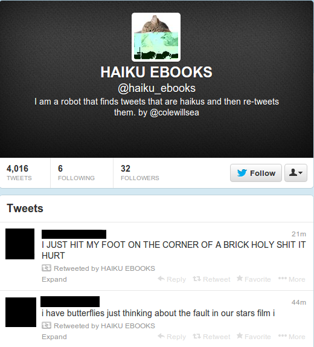

# A ROBOT THAT SCANS TWITTER FOR TWEETS THAT ARE HAIKUS AND THEN RETWEETS THEM.

[HAIKU_EBOOKS 
](https://twitter.com/haiku_ebooks)

a monkey-patch on Strings so that they know whether or not they are haikus.
uses a modified version of the CMU pronunciation dictionary for syllables.

## NEW AND IMPROVED TO FIND BETTER HAIKUS!!

### CONFUSING TEENAGERS ON TWITTER SINCE 2013!
